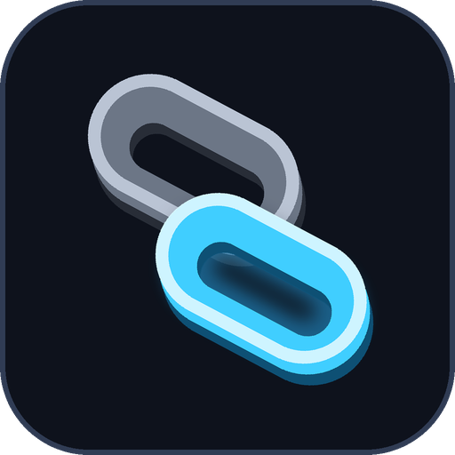

# Phone notifications

A small program that sits outside WoW and sends a notification to your phone
when the instance is reset or somebody starts a ready check — the two moments
you are usually not looking at the screen.

**It is optional.** The addon works perfectly well without it, and nothing in
the addon depends on it being installed.

## Why it has to be a separate program

A WoW addon has **no network access of any kind** — no HTTP, no sockets. That
is true of every addon ever written, so nothing running inside the game can
reach ntfy, Discord or a phone. What the game *does* do is write its chat to a
log file, and a program outside the game can watch that file.

```
WoW  ──writes──▶  Logs/WoWChatLog.txt  ──watched by──▶  ChainPush  ──▶  ntfy / Discord
```

It only reads a file. It never touches WoW, never reads its memory, never
sends it anything, and does not automate any part of playing.

---

## The easy way: ChainPush

A **Dock icon on a Mac** and a **system tray icon on Windows**. It sits there
the whole time it is working, so there is never a question of where it went,
and clicking it gives you the status, a test, and the settings.



```
  Chain Push

  Watching - 3 sent
  Sending to ntfy topic my-secret-topic-4471
  Last: Instance reset - from Chain

  [ Close ]   [ Send a test ]   [ Settings... ]
```

First run asks two questions — ntfy or Discord, and the one thing that
identifies you — and then gets out of the way. Everything is remembered.

**Is it running?** The icon is in the Dock or the tray. Click it and the first
line says so in words. If the watcher ever dies the app notices and restarts
it rather than sitting there looking fine.

**Closing the window does not stop it.** Click the icon again to bring it
back. **Quit** in the Dock menu, or in the tray menu, is the only thing that
stops it.

**Nothing to install.** On Windows the tray icon is drawn with what has been
in Windows since 1996. On a Mac the app is built by `osacompile`, which is
part of macOS.

**Desktop notifications too**, with the Chain icon on them, so you can see
it working without picking the phone up.

### Getting it

**macOS — one double-click to build, then never again.** Double-click
`build-mac-app.command` in this folder. It runs `osacompile`, which is part of
macOS, and produces `ChainPush.app` beside it. Nothing is downloaded and
nothing is installed. Open that app, and drag it to your Applications folder
or the Dock if you want it handy.

It is built rather than shipped because what comes out is an **AppleScript
applet** — a real Cocoa application. That matters: a shell script in an app
bundle cannot receive a click, which is why the old one had no way back once
you closed its window. A real app has a Dock icon you can click, a Quit that
works, and it costs nothing at all while it waits.

**Settings...** opens whichever settings screen this Mac can draw — the full
window where there is a `python3` with a modern Tk, the Mac's own dialogs
where there is not. Apple's own `python3` carries Tk 8.5.9, which on any
recent macOS draws an empty white rectangle, so it is not trusted on sight.

*(There was a menu bar version. It is gone: on a Mac with a full menu bar
macOS quietly gave it a slot at the far left where nothing is visible, and the
scripting host burned half a processor drawing it. A Dock icon is always
there, always clickable, and free.)*

If macOS says it cannot check the app for malicious software: right-click it →
**Open** → **Open**. That happens because it is not signed with a paid Apple
certificate, and once is enough.

**Windows.** Double-click `ChainPush.bat` — it puts the icon in the tray and
that is that. Or build `ChainPush.exe`:

```bash
python3 -m pip install pyinstaller pillow
python3 build.py          # -> dist/ChainPush.exe
```

Windows SmartScreen may say the same thing as Gatekeeper: **More info** →
**Run anyway**.

A program can only be built on the system it is for, so the GitHub workflow at
`push/github-workflow-chainpush.yml` (move it to `.github/workflows/` in your
repo) builds the Windows executable and a macOS bundle and attaches them to a
release.

**Anything, from the source:**

| | |
|---|---|
| macOS, Dock | `build-mac-app.command` once, then `ChainPush.app` |
| Windows, tray | `ChainPush.bat`, or `pythonw tray_win.py` |
| no icon, just a terminal | `python3 chainpush.py --saved --serve` |
| the old window | `python3 chainpush_gui.py` |
| macOS dialogs only | `bash chainpush.sh` |

After changing any of the sources, `python3 mac_app.py` copies them back into
the built app, so it is not left carrying yesterday's copy.

---

## What you paste in

### ntfy

Free, no account. Install **ntfy** from the App Store or Google Play, then
subscribe to a topic — a name you make up.

> Make it long and odd: `dan-wow-4471-kf`, not `wow`. A topic is the only
> secret there is. Anyone who guesses it can read your alerts.

Put the same name in the program. Nothing else to do.

Running your own ntfy server? Change the server field from `https://ntfy.sh`.

### Discord

Channel you can edit → **Edit channel** → **Integrations** → **Webhooks** →
**New webhook** → **Copy webhook URL**. Paste that in. Turn on notifications
for that channel on your phone, or you will not hear it.

---

## How the alert actually gets out

The obvious route — the addon writes a line, this program reads it — turns out
to be slow, and the reason is worth knowing before you wonder why:

**WoW writes its chat log in 48 KiB blocks.** Nothing you can call from an
addon flushes it. Measured on a live session, a marker written at 18:57 reached
the disk at 19:00, and during a quiet spell at the summoning stone it can sit
there for ten minutes. Which is exactly when you need it.

**Screenshots are not buffered.** The client writes the file the moment it is
asked. So that is the signal: the addon takes **one** screenshot for a ready
check and **two** in quick succession for a reset, this program watches the
`Screenshots` folder, counts the batch, sends the push, and deletes the files
again. Two seconds, every time.

Turn it on with **Instant alert (screenshot)** in the addon's settings. It
costs a flash and a "Screenshot captured" line in chat; that is the whole
price. The chat-log marker stays on as a slow second path, and the game's own
reset messages are still read from the log for what they are worth.

The folder is created if it does not exist — WoW only makes it the first time
somebody takes a screenshot, and if you never have, it is not there.

## What gets sent

| | needs the addon's marker? |
|---|---|
| the instance has been reset | no |
| a reset failed, and why | no |
| someone started a ready check | yes |
| you levelled | yes, and it is off by default |

The first two are the game's own wording and are already in the log. A ready
check produces no chat line at all, so the addon writes one itself — into a
channel only your character is in, removed from your chat windows so you never
see it. `/level signal` turns that on.

The same event is often announced twice — once by the game, once by somebody
else's addon. Repeats inside twenty seconds are dropped, so your phone buzzes
once.

## Chat logging has to be on

The log file only exists once WoW has been told to write it. Either type
`/chatlog` in game, or turn on **Write a marker to the chat log** in the
addon's settings, which does it for you. If the program cannot find the file,
press **Find**, and if that fails, **Browse** to it — it is in the `Logs`
folder of your WoW install.

## The command line, if you prefer it

```bash
python3 chainpush.py --ntfy my-secret-topic --test   # check it reaches you
python3 chainpush.py --ntfy my-secret-topic          # then leave it running
python3 chainpush.py --discord https://discord.com/api/webhooks/...
python3 chainpush.py --saved                         # use the window's settings
```

Without Python at all, the shell version takes two of the same switches:

```bash
bash chainpush.sh --test     # send one notification and stop
bash chainpush.sh --watch    # watch and send, printing what it does
```

| | |
|---|---|
| `--log PATH` | where `WoWChatLog.txt` is, if it is somewhere unusual |
| `--ntfy-server URL` | your own ntfy server |
| `--priority` | ntfy priority: `min`, `low`, `default`, `high`, `urgent` |
| `--quiet-for N` | seconds before the same event may repeat (default 20) |
| `--enable levelup` | turn on a rule that is off by default |
| `--test` | send one notification and stop |

Stop it with Ctrl+C.

## Where the settings are kept

| | |
|---|---|
| Windows | `%APPDATA%\Chain\push.json` |
| macOS | `~/Library/Application Support/Chain/push.json` |
| Linux | `~/.config/leveltracker/push.json` |

Plain text. Delete it to start over. Your topic or webhook is in it, so it is
worth the same care as any other password.
